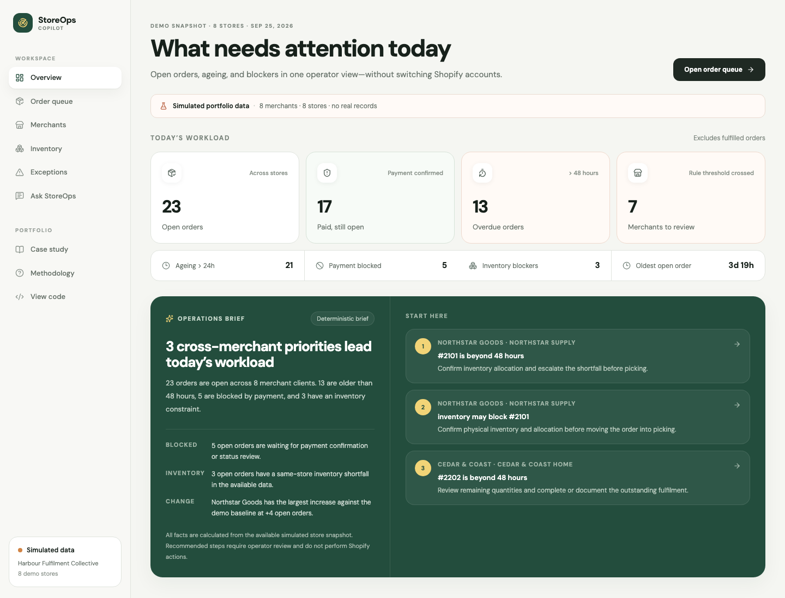
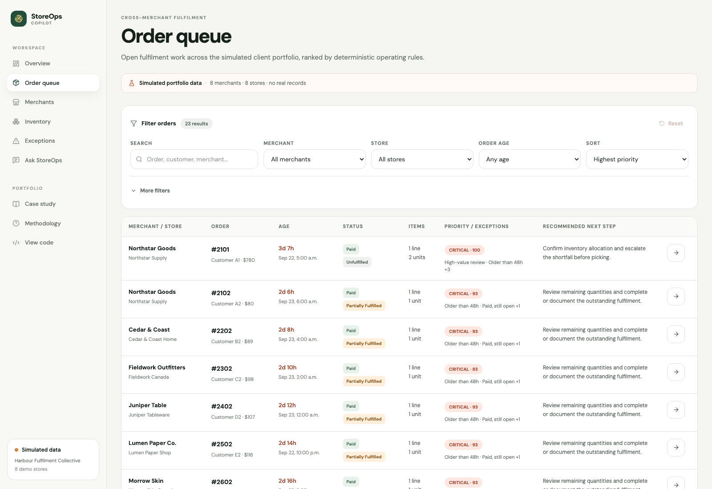
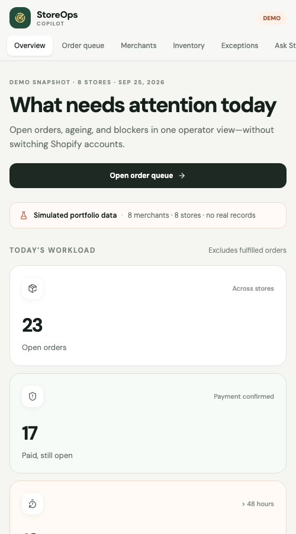
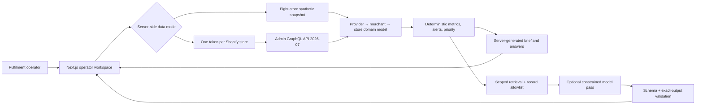

# StoreOps Copilot

**A cross-merchant Shopify fulfilment workspace for third-party operators.**

**Live demo:** [storeops-copilot.vercel.app](https://storeops-copilot.vercel.app)

StoreOps Copilot brings open orders, payment blocks, ageing, inventory shortfalls, and merchant backlogs from multiple client stores into one queue. Rule-based ranking explains what to review first; source-linked Q&A shows the records behind each answer.

> Independent portfolio prototype. Synthetic data, read-only, no client deployment or measured impact.

## Discovery context and product hypothesis

While helping a third-party fulfilment operator examine its Shopify workflows, I observed a team repeatedly switching between merchant-owned Shopify accounts to review orders, confirm payment and fulfilment readiness, inspect customer and line-item context, identify exceptions, and track unfinished work. The observed operation managed approximately eight merchant accounts and performed approximately 24 recurring account and workflow checks per day. Those figures describe discovery context—not usage of this prototype or measured impact.

**Primary user:** a fulfilment operator or manager processing orders on behalf of multiple client merchants.

**Hypothesis:** a unified, explainable operations queue can help operators identify and prioritize cross-merchant fulfilment work while maintaining the context and trust required to act safely.

## What the MVP supports

- **Operations overview:** cross-merchant workload, ageing, payment blocks, inventory constraints, and an operations brief.
- **Unified order queue:** open-order default; filter by merchant, store, payment, fulfilment, age, priority, exception, and date; sort by priority, age, merchant, or value when one currency is in scope.
- **Merchant backlog view:** open, paid and still open, ageing, partial, blocked, average age, oldest order, supported trend, service target, and review level.
- **Order detail:** merchant/store identity, customer, line items, inventory, notes, exceptions, rule-based priority, rationale, and next step.
- **Exceptions and inventory:** supporting data, exact thresholds, and human-reviewed recommendations.
- **Ask StoreOps:** a bounded set of cross-store and merchant-scoped questions answered from current records, with source links and explicit declines when the available data is insufficient.

The product model is explicit:

```text
Fulfilment provider
└── Client merchant
    └── Shopify store
        ├── Orders and fulfilment tasks
        ├── Customers (same-store identity/value only)
        ├── Products and inventory
        └── Operational alerts
```

## Demo data

The default public experience contains one fictitious fulfilment provider, eight fictitious merchants, eight simulated Shopify stores, 56 orders, and supporting products and synthetic customers. It includes paid/unfulfilled, fulfilled, partial, payment-blocked, 24-hour and 48-hour ageing, high-value delay, increasing backlog, inventory constraints, repeat customers, and one clear/no-risk merchant. All emails use `.test`; no identity or record represents a real party.

### Operations overview



### Unified order queue





## Alert and priority logic

Alerts are deterministic. The model does not decide whether a rule was crossed.

| Signal | Prototype rule |
|---|---|
| Paid and unfulfilled | Open order with confirmed payment |
| Age warning / overdue | Open order beyond 24h / 48h |
| High-value delay | Open order value at least 500 in store currency |
| High-value customer delay | Same-store customer value and delay thresholds both crossed |
| Partial fulfilment | Shopify fulfilment state is partial |
| Payment blocked | Open order without paid or authorized status |
| Inventory constraint | Same-store variant availability below required quantity |
| Increasing merchant backlog | Demo open orders and change against the seeded baseline cross configured thresholds |

The **operational priority score** combines order age, merchant service-level target, payment readiness, fulfilment state, order value, same-store customer value, merchant backlog, and inventory availability. It is rule-based prioritization—not predictive AI or autonomous decision-making. Defaults live in `lib/domain/config.ts` and require operator validation before production use.

## Record-grounded answer design

1. Classify the question into a closed intent registry.
2. Determine all-store, merchant, or store scope.
3. Retrieve only records inside that scope.
4. Calculate metrics, alerts, and priority outside the model.
5. Compose the answer, recommendation, source links, and record allowlist on the server.
6. Optionally send scoped facts and the approved answer through the OpenAI Responses API under a strict JSON schema.
7. Accept the model output only when every field, value, link, identifier, and array position matches the approved answer.
8. Use the deterministic answer when credentials are missing, the request fails, or any output changes.

The current model path is deliberately narrow: it does not select records, calculate metrics, write recommendations, or paraphrase accepted output. It tests output containment without making the workflow depend on model creativity. That is a safeguard experiment, not evidence that AI improves fulfilment performance.

## Architecture



See [the detailed architecture](./docs/architecture.md).

## Run locally

```bash
git clone https://github.com/umeanougo/storeops-copilot.git
cd storeops-copilot
npm install
npm run dev
```

Open [http://localhost:3000](http://localhost:3000).

### Explicit demo mode

```bash
cp .env.example .env.local
# Keep STOREOPS_DATA_MODE=demo
npm run dev
```

No credentials are required. Missing live credentials or a failed live request produces a visible demo fallback rather than a broken public experience.

## Optional local Shopify connection

The prototype supports one development store through `SHOPIFY_STORE_DOMAIN` and `SHOPIFY_ADMIN_ACCESS_TOKEN`, or multiple server-side connections through `SHOPIFY_STORES_JSON`. Each configured connection includes internal merchant/store IDs, names, domain, token, API version, and connection state. Tokens never enter browser code. Live mode is deliberately disabled in production builds because this portfolio prototype has no operator authentication; the public deployment always falls back to synthetic data.

Required read scopes are `read_orders`, `read_customers`, `read_products`, and `read_inventory`; add `read_all_orders` only when approved access beyond Shopify’s default order-history window is required. This portfolio integration uses a development/custom-app token path, not production public-app OAuth.

```bash
STOREOPS_DATA_MODE=live
SHOPIFY_API_VERSION=2026-07
SHOPIFY_STORE_DOMAIN=example.myshopify.com
SHOPIFY_ADMIN_ACCESS_TOKEN=shpat_...
```

For multiple stores, see `.env.example`. Never commit credentials. Live multi-store behavior remains credential-dependent and has not been verified against eight real stores.

## Optional OpenAI connection

```bash
OPENAI_API_KEY=sk_...
OPENAI_MODEL=gpt-5.6-terra
```

This enables the constrained model-output path; it does not unlock additional conclusions or rewrite the server-generated answer. Without a key, the same product remains usable through deterministic briefs and answers.

## Security, privacy, and tenant separation

- Public data is simulated and clearly labelled; no client, merchant, or customer PII is committed.
- Shopify and OpenAI credentials are server-only and ignored by Git.
- The product is read-only: no fulfilment, inventory, order, customer, or refund mutation routes exist.
- Retrieval and customer value are scoped by merchant and store identifiers.
- The public demo is an internal operator view; it does not imply merchants can see one another’s data.

Production would require Shopify OAuth and merchant authorization, encrypted tenant-scoped token storage and rotation, role-based access, row-level tenant isolation, audit logs, retention/deletion controls, privacy agreements, protected-customer-data review, LLM governance, observability, and incident response. See [security and privacy notes](./docs/security-privacy.md).

## Trade-offs and limitations

- Demo-first proves the workflow without pretending the access model is production-ready.
- Structured retrieval is simpler and safer than a vector database for this bounded dataset.
- A server-side connection list is sufficient for the prototype; production needs encrypted persistence and OAuth lifecycle handling.
- Rules are inspectable but not yet calibrated with external operator testing.
- Ask StoreOps supports a closed question set; it is not a general store-data chatbot.
- The OpenAI path tests strict output containment but does not yet demonstrate useful generative synthesis.
- The snapshot is read-oriented; no webhooks, background sync, carrier events, complete history, location allocation, or fulfilment writes.
- Currency is preserved per store and not summed into a misleading cross-currency revenue metric.
- The system does not know staffing, carrier cutoffs, margin, inbound stock, or merchant-specific exception policy.

## Dogfooding and proposed success metrics

Personal dogfooding covered all-store review, merchant/store filtering, 48-hour ageing, payment readiness, partial fulfilment, inventory blocks, no-risk merchants, scoped questions, invalid references, and deterministic fallbacks. These are personal observations, not external user feedback; see [dogfooding notes](./docs/dogfooding-notes.md).

Future validation would measure time to identify awaiting work, account switches per operator, time to review backlogs, overdue-order recall, alert usefulness and false-positive rate, time from readiness to fulfilment action, orders within service targets, operator confidence, cited-answer support, unsupported-question declines, and repeat use. All are **proposed metrics**; no measured improvement is claimed.

## Quality checks

```bash
npm test
npm run lint
npm run typecheck
npm run build
```

## Roadmap if the hypothesis earns investment

1. Observe five fulfilment operators completing a real morning triage and compare the queue with their source-of-truth review.
2. Calibrate per-merchant service levels, alert usefulness, false positives, and exception policy.
3. Add OAuth, encrypted token lifecycle, tenant isolation, roles, and audit logging.
4. Add webhook-driven incremental sync, coverage diagnostics, bulk history, location-aware inventory, and carrier events.
5. Evaluate safe, confirmed handoffs into Shopify Admin before considering any write action.

## Shopify application context

I built this project for a Shopify Product Manager application to demonstrate direct workflow discovery, merchant/operator empathy, Shopify data-model and API fluency, narrow MVP judgment, record-grounding safeguards, dogfooding, testing, and the ability to move independently from an ambiguous problem to working software. AI coding tools accelerated framing, implementation, debugging, testing, and documentation; I retained responsibility for product scope, rules, safeguards, technical validation, and quality.

## Portfolio artifacts

- [Case study](./app/case-study/page.tsx)
- [Methodology](./app/methodology/page.tsx)
- [Architecture](./docs/architecture.md)
- [Dogfooding notes](./docs/dogfooding-notes.md)
- [Demo scripts](./docs/demo-script.md)
- [Application and resume copy](./docs/application-copy.md)
- [Screenshot plan](./docs/screenshots.md)
- [Security and privacy](./docs/security-privacy.md)

Portfolio source available for review under [PORTFOLIO-LICENSE.md](./PORTFOLIO-LICENSE.md). Built independently by Ugo Umeano; not affiliated with or endorsed by Shopify.
