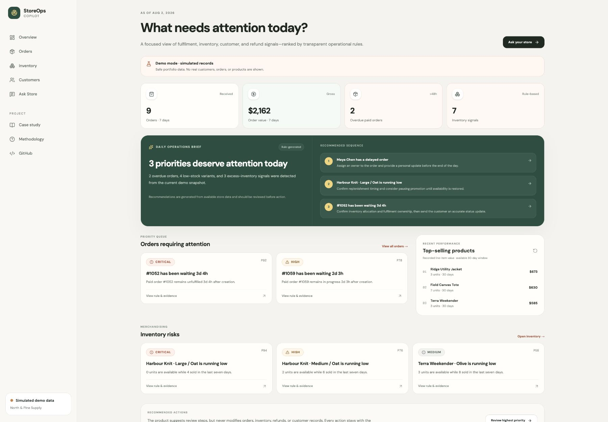
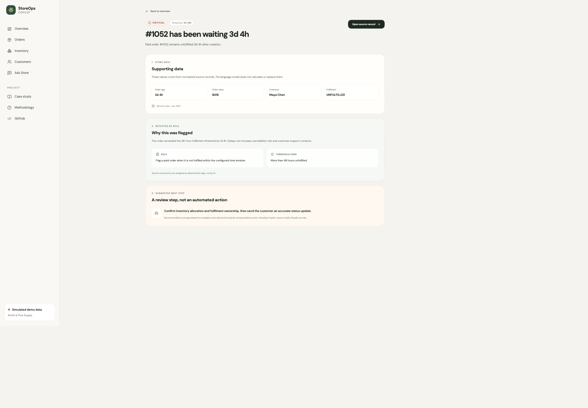
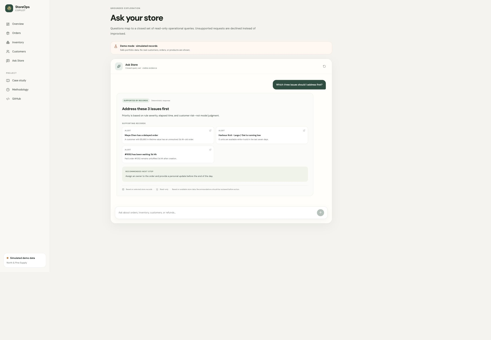
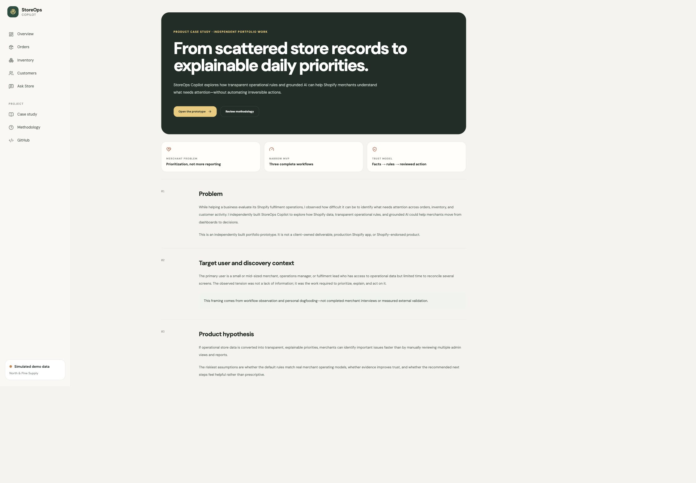
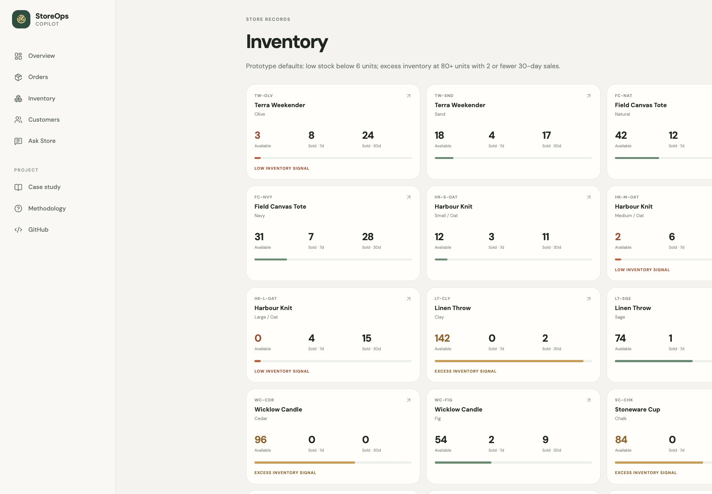
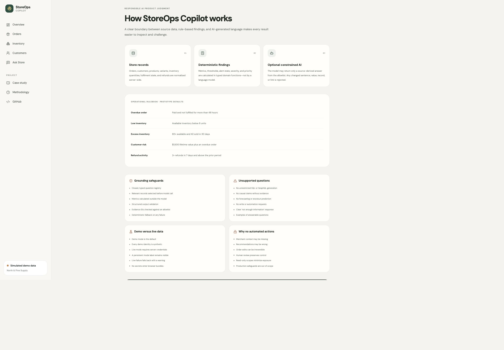
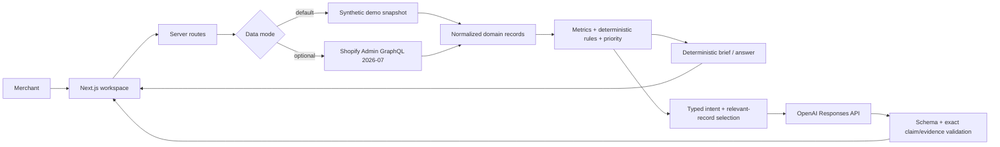

# StoreOps Copilot

**An independently built, AI-assisted Shopify operations portfolio prototype inspired by real workflow discovery.**

StoreOps Copilot helps a merchant or fulfilment lead answer one practical question: **What needs attention today?** It turns orders, inventory, customer, and refund records into transparent operational priorities, explains the rule behind each finding, and recommends a human-reviewed next step.

> This is a portfolio prototype, not a production Shopify app, client deliverable, or Shopify-endorsed product.

## Why I built it

While helping a business evaluate its Shopify fulfilment operations, I observed how difficult it can be to identify what needs attention across orders, inventory, and customer activity. The problem was not a lack of dashboards. It was the work required to reconcile signals, judge priority, explain why an issue mattered, and decide what to do next.

The product hypothesis:

> If operational store data is converted into transparent, explainable priorities, merchants can identify important issues faster than by manually reviewing multiple admin views and reports.

## Target user

A small or mid-sized Shopify merchant, operations manager, fulfilment lead, or ecommerce operator who needs a calm daily priority view without manually reviewing several reports.

## Key workflows

1. **Overdue order:** identify an unfulfilled order beyond 48 hours, inspect the supporting order, see the exact rule, and review a suggested next step.
2. **Inventory risk:** identify low or excess inventory, inspect units and sales velocity, and understand the threshold used.
3. **Ask Store:** ask a natural-language operational question and receive a concise answer grounded in linked, visible records.

The demo also includes high-value-customer risk, refund activity, daily brief generation, customer and record views, a case study, and a responsible-AI methodology page.

## Screenshots

| Overview | Explainable issue |
|---|---|
|  |  |

| Ask Store | Case study |
|---|---|
|  |  |

| Inventory risk | Responsible-AI methodology |
|---|---|
|  |  |

## Try it locally

```bash
git clone https://github.com/umeanougo/storeops-copilot.git
cd storeops-copilot
npm install
npm run dev
```

Open [http://localhost:3000](http://localhost:3000). No credentials are required. The app starts in demo mode with clearly labelled synthetic data.

## Demo mode

Demo mode is the default even without an environment file:

```bash
cp .env.example .env.local
# STOREOPS_DATA_MODE=demo
npm run dev
```

The seeded dataset includes recent and older orders, several fulfilment states, an order overdue beyond 48 hours, low-stock and excess-inventory variants, a product with no 30-day sales, high-value repeat customers, refunds, and an operational anomaly. Every identity and record is synthetic.

## Optional live Shopify setup

This portfolio path uses a custom app or development-store token instead of public OAuth.

1. Create a custom app in a Shopify development store.
2. Grant only the required read scopes.
3. Install the app and copy its Admin API access token.
4. Configure `.env.local`:

```bash
STOREOPS_DATA_MODE=live
SHOPIFY_STORE_DOMAIN=your-store.myshopify.com
SHOPIFY_ADMIN_ACCESS_TOKEN=shpat_...
SHOPIFY_API_VERSION=2026-07
```

Required scopes:

- `read_orders`
- `read_customers`
- `read_products`
- `read_inventory`
- `read_locations` if location-level inventory is added
- `read_all_orders` only if history older than 60 days is required and approved

The current prototype uses `inventoryQuantity` for aggregate variant availability and does not request location records. Admin tokens remain server-side. The GraphQL client handles top-level errors, optional fields, currencies, pagination caps, and throttle metadata. If live retrieval fails, the UI visibly falls back to demo data.

## Optional OpenAI setup

```bash
OPENAI_API_KEY=sk_...
OPENAI_MODEL=gpt-5.6-terra
```

The application uses the OpenAI Responses API as an optional, schema-constrained answer-selection layer. It accepts model output only when every source-derived sentence and evidence field matches the deterministic allowlist. Without a key—or after any API, schema, or validation failure—the same workflows use deterministic fallback copy.

## Environment variables

| Variable | Required | Purpose |
|---|---:|---|
| `STOREOPS_DATA_MODE` | No | `demo` by default; set `live` for a development store. |
| `SHOPIFY_STORE_DOMAIN` | Live only | Development-store `.myshopify.com` domain. |
| `SHOPIFY_ADMIN_ACCESS_TOKEN` | Live only | Server-side custom-app Admin token. |
| `SHOPIFY_API_VERSION` | No | Defaults to pinned version `2026-07`. |
| `OPENAI_API_KEY` | No | Enables the constrained Responses API path; deterministic fallback remains available. |
| `OPENAI_MODEL` | No | Defaults to `gpt-5.6-terra`. |

## Architecture



See [the detailed architecture](./docs/architecture.md).

## Operational rules

| Rule | Prototype default | Determined by |
|---|---|---|
| Overdue order | Paid and more than 48 hours without fulfilment | Code |
| Low inventory | Fewer than 6 available units | Code |
| Excess inventory | 80+ units and no more than 2 units sold in 30 days | Code |
| High-value customer risk | $1,500+ lifetime value plus an overdue order | Code |
| Refund activity | 2+ refunds in 7 days and above the prior 7-day period | Code |

Thresholds are configurable in `lib/domain/config.ts`. They are prototype defaults, not universal merchant policy. Severity, supporting facts, and priority scores are also deterministic.

## AI grounding approach

For every question:

1. Classify into a closed, typed intent registry.
2. Select only relevant normalized records.
3. Calculate metrics and alerts outside the model.
4. Build an exact, source-derived claim and evidence allowlist.
5. Require a JSON-schema response.
6. Validate it with Zod.
7. Reject any altered sentence, value, label, link, ordering, or record identifier.
8. Fall back to a deterministic answer on any failure.

The model cannot create an alert, assign severity, rewrite a factual claim, change a value, reorder priorities, generate SQL/GraphQL, or perform a Shopify write action. Unsupported questions receive a clear decline. This is intentionally conservative: model output is accepted only when it selects the precomputed, source-derived answer exactly.

## Product decisions and trade-offs

- **Demo-first:** a recruiter can use every critical workflow without configuration.
- **Rules before AI:** trust and testability matter more than appearing autonomous.
- **Visible evidence:** every issue separates store data, rule-based finding, and suggested action.
- **Read-only:** the prototype recommends review steps but performs no order, inventory, customer, or refund writes.
- **No vector database:** structured data is small enough for typed filtering and live retrieval.
- **Bounded pagination:** appropriate for a portfolio dev store; bulk operations are a future scale path.
- **Custom-app token:** proves the API integration without delaying the learning loop with public OAuth.

## Privacy and security

- No real merchant or customer data is committed.
- Demo emails use the reserved `.test` domain.
- Tokens are server-side and ignored by Git.
- Logs do not include access tokens or customer payloads.
- The app requests read scopes only and exposes no mutation route.
- Demo/live mode is persistent and explicit.
- Production use would require stronger data minimization, retention controls, tenant isolation, protected-customer-data review, encryption, model-vendor assessment, and audit logging.

See [security and privacy notes](./docs/security-privacy.md).

## Testing

The test suite prioritizes business logic:

- threshold boundaries and overdue-order states
- low and excess inventory
- high-value-customer risk
- refund activity
- severity and priority ordering
- date and currency handling
- Shopify optional-field normalization
- grounded record selection
- unsupported questions
- unknown-record rejection
- fallback brief stability
- demo mode without credentials
- empty data and no-alert behavior

```bash
npm test
npm run lint
npm run typecheck
npm run build
```

## Deployment

The project is Vercel-compatible and requires no variables for the public demo:

```bash
npx vercel
```

Keep `STOREOPS_DATA_MODE=demo` in a public deployment unless live credentials are securely configured. Never add Shopify or OpenAI secrets to browser-visible variables.

## Known limitations

- This is not production-ready and has not been validated with external merchants.
- Prototype rules do not know margin, seasonality, inbound stock, carrier events, or product strategy.
- Live retrieval is capped and nested records may be truncated.
- Refund comparison uses a simple recent-versus-prior window, not statistical anomaly detection.
- Sales velocity is derived from the loaded order window.
- The prototype does not forecast stockouts or explain causal change.
- No public OAuth, multitenancy, webhooks, billing, background sync, or write actions.

## Roadmap, if the hypothesis earns investment

1. Five merchant discovery interviews and task-based usability testing.
2. Merchant-configured thresholds and explicit alert feedback.
3. Factuality and unsupported-question eval suite.
4. OAuth onboarding and stronger protected-data controls.
5. Incremental sync, coverage diagnostics, and bulk-history retrieval.
6. Safe handoff into Shopify admin—still requiring merchant confirmation.

## What I learned

The strongest AI product decision was to give the model less authority. Keeping facts, alert state, severity, priority, and record selection deterministic made the experience easier to inspect, test, and explain. AI is most useful here as a constrained communication layer, not an operational source of truth.

## Application context

I built this project for an active Shopify Product Manager application to demonstrate merchant empathy, narrow MVP definition, writing and evaluating code, API fluency, rapid prototyping, independent ownership, responsible AI judgment, dogfooding, and clear trade-off decisions. AI tools increased iteration speed; I retained responsibility for product scope, rules, technical validation, and quality.

## Portfolio artifacts

- [Product case study](./app/case-study/page.tsx)
- [Responsible-AI methodology](./app/methodology/page.tsx)
- [Architecture](./docs/architecture.md)
- [Dogfooding notes](./docs/dogfooding-notes.md)
- [Demo scripts](./docs/demo-script.md)
- [Application copy](./docs/application-copy.md)
- [Screenshot plan](./docs/screenshots.md)
- [Security and privacy](./docs/security-privacy.md)

## Licence

Portfolio source available for review. See [PORTFOLIO-LICENSE.md](./PORTFOLIO-LICENSE.md).

---

Built independently by Ugo Umeano. Not affiliated with or endorsed by Shopify.
