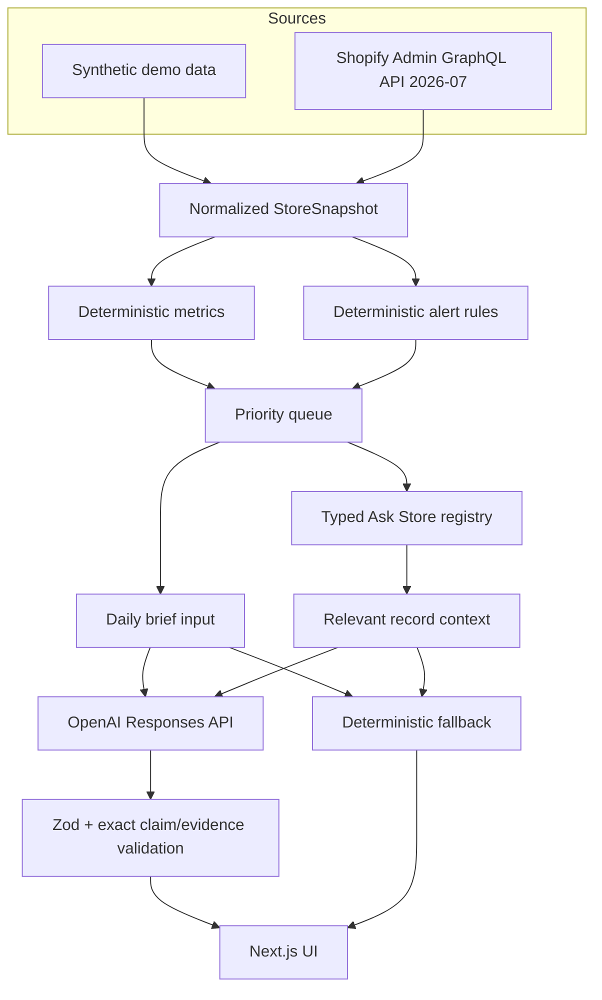
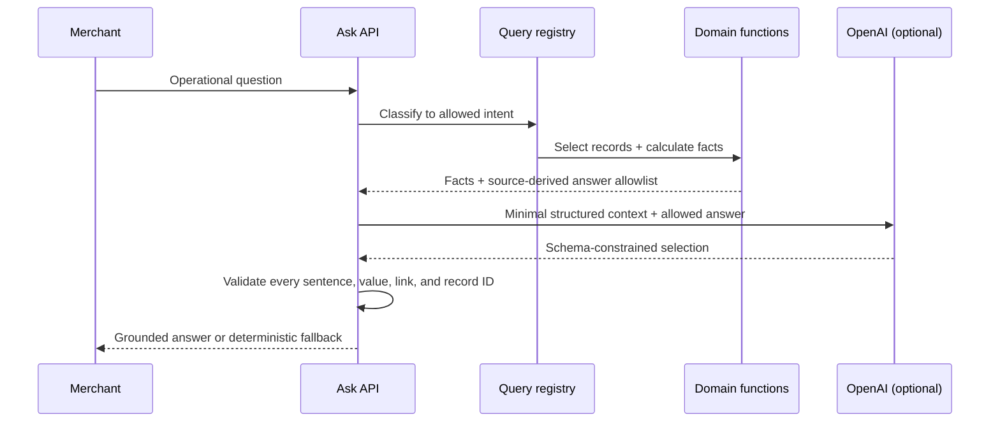

# Architecture

StoreOps Copilot is intentionally a small retrieval-and-decision system. Shopify or demo data remains the source of truth; domain rules create findings; AI is an optional writing layer.

## Separation of concerns

- `lib/demo`: realistic synthetic source records.
- `lib/shopify`: server-only GraphQL transport and response normalization.
- `lib/domain`: types, configurable rules, metrics, priority, formatting, and fallback brief.
- `lib/grounding`: intent classification, relevant-record retrieval, fallback answers, and evidence validation.
- `lib/ai`: optional Responses API synthesis with structured output.
- `app/api`: small server endpoints for the brief, Ask Store, and a demo-only diagnostic snapshot.
- `components` and `app`: presentation and route composition only.
- `tests`: business rules, grounding, normalization, date/currency, and credential-free behavior.

## Data flow for Ask Store

## Live integration boundaries

- Custom-app Admin token only; no browser access.
- `2026-07` is pinned rather than `latest`.
- Queries request only required fields.
- Connections paginate with cursors and a documented prototype cap.
- Top-level GraphQL errors, HTTP failures, optional fields, currency, and throttle metadata are handled.
- A production adapter should split list and detail queries, add retry/backoff for transient throttling, track coverage completeness, and use Bulk Operations for deep history.

## Why this architecture

It makes the riskiest product behavior—the decision logic—easy to inspect and test. It also creates explicit failure boundaries: missing credentials select demo mode, live failure is visible, invalid model output falls back, and unsupported questions never become improvised database access.
