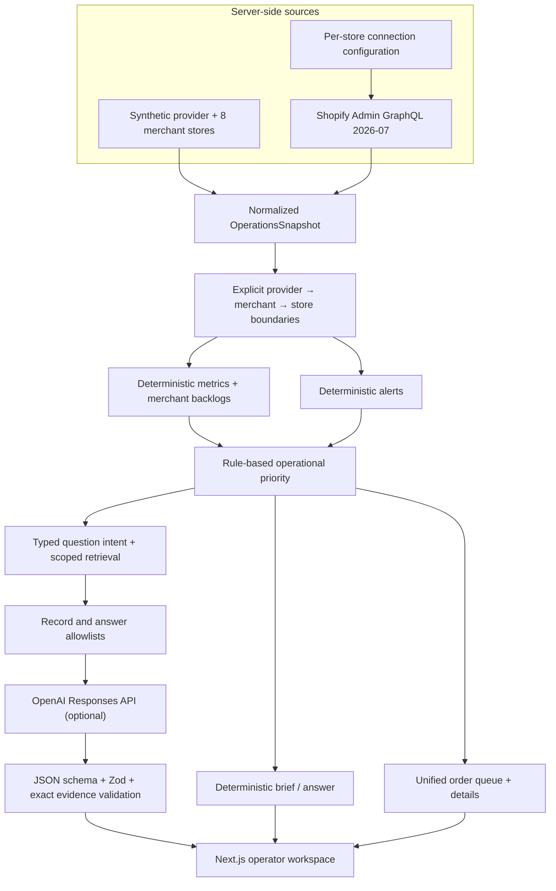
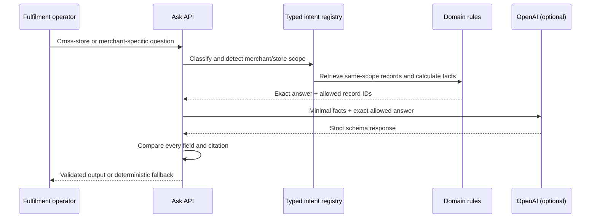

# Architecture

StoreOps Copilot is a read-only retrieval-and-decision prototype. Shopify or demo records remain the source of truth; domain rules create findings and priority; AI is an optional constrained communication layer.

## Domain and separation

- `FulfilmentProvider` owns the internal operations workspace.
- `Merchant` belongs to one provider and carries its service-level target.
- `ShopifyStore` belongs to one merchant and carries domain, currency, timezone, mode, and connection state.
- Every order, customer, product, variant, alert, recommendation, and task carries both `merchantId` and `storeId`.
- Customer identity, lifetime value, products, and inventory are never joined across stores.

This explicit separation is a prototype guardrail, not a substitute for production row-level tenant controls.

## Ask StoreOps sequence

## Code boundaries

- `lib/demo`: simulated multi-store source records.
- `lib/shopify`: server-only per-store GraphQL transport and normalization.
- `lib/domain`: types, thresholds, alerts, backlog metrics, priority, and deterministic brief.
- `lib/grounding`: intent classification, scope detection, retrieval, answer allowlists, and evidence validation.
- `lib/ai`: optional Responses API calls and exact output validation.
- `app/api`: read-only brief, Ask StoreOps, and demo diagnostic routes.
- `app` and `components`: operator workflow presentation.
- `tests`: domain boundaries, rules, grounding, normalization, and failure behavior.

## Live integration boundaries

- One server-side token per installed store; none reaches the browser.
- API version `2026-07` is pinned.
- Queries use verified Admin GraphQL fields and read-only scopes.
- Cursor pagination is capped for the prototype; throttle metadata and top-level errors are handled.
- Demo fallback is visible if a live connection is incomplete or fails.
- Production needs OAuth, encrypted credential persistence/rotation, tenant roles, webhook sync, retry/backoff, coverage diagnostics, and Bulk Operations for deep history.

The architecture keeps the highest-risk behavior inspectable: facts, alerts, and ranking are deterministic; record scope is explicit; invalid or unavailable model output cannot change the operational answer.
